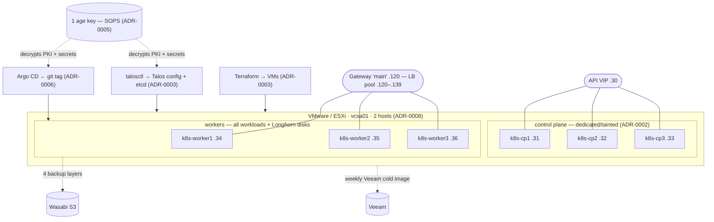

# Architecture — homeoffice-k8s

The map of the `k8s-talos1` cluster: how the pieces fit and where each is documented. This file
deliberately **does not duplicate** facts that live elsewhere — versions are in
[`VERIFIED-VERSIONS.md`](VERIFIED-VERSIONS.md), the build narrative is in [`posts/`](posts/),
the *why* behind each choice is in [`adr/`](adr/), and the authoritative spec is
[`PLAN.md`](PLAN.md). It links to those rather than restating them.

## System map

## Layers and where they live

| Layer | What | Built in | Decision |
|---|---|---|---|
| Infrastructure | 6 VMs from a Talos OVA template | `terraform/` · [post 02](posts/02-vmware-and-terraform.md) | [ADR-0003](adr/0003-terraform-talosctl-no-ansible.md) |
| OS / cluster | Talos config, PKI, etcd bootstrap | `talos/` · `scripts/` · [post 03](posts/03-talos-config-and-secrets.md) | [ADR-0002](adr/0002-dedicated-control-planes.md) · [ADR-0001](adr/0001-vmtoolsd-guest-agent-extension.md) |
| Secrets | SOPS + age, one key (PKI + app secrets) | `.sops.yaml` · `*.sops.yaml` · KSOPS | [ADR-0005](adr/0005-sops-age-single-key.md) |
| GitOps | Argo app-of-apps, release-pinned to a tag | `kubernetes/bootstrap/` · `kubernetes/apps/platform-appset.yaml` · [post 04](posts/04-gitops-bootstrap.md) | [ADR-0006](adr/0006-release-pinned-gitops.md) |
| Networking | Cilium CNI + LB + Gateway API | `kubernetes/apps/{cilium,gateway}/` · [post 05](posts/05-networking.md) | [ADR-0004](adr/0004-cilium-l2-gateway-api.md) |
| Storage / DB | Longhorn + CloudNativePG | `kubernetes/apps/{longhorn,cnpg-*,barman-cloud-plugin}/` · [post 06](posts/06-storage-and-databases.md) | [ADR-0007](adr/0007-longhorn-cnpg-storage-model.md) |
| Identity / TLS | Authentik + cert-manager | `kubernetes/apps/{authentik,cert-manager}/` · [post 07](posts/07-identity-and-tls.md) | — |
| Backups / DR | 4 layers + Veeam | `kubernetes/apps/{etcd-backup,velero}/` · `scripts/cluster-*.sh` · [`DR-RUNBOOK.md`](DR-RUNBOOK.md) · [post 08](posts/08-backups-and-disaster-recovery.md) | [ADR-0008](adr/0008-backups-two-host-limitation-veeam.md) |

## Sync-wave order

Argo applies the platform components in dependency order via per-Application sync-waves. This is
the authoritative list (source: `kubernetes/apps/platform-appset.yaml`):

| Wave | Component | Namespace | Role |
|---:|---|---|---|
| −10 | cilium | `kube-system` | CNI + LB + Gateway API — nodes go Ready |
| −5 | cert-manager | `cert-manager` | issuer + webhook (needed before TLS and CNPG plugin) |
| 0 | gateway | `gateway` | shared `Gateway main` + wildcard Certificate |
| 1 | longhorn | `longhorn-system` | replicated block storage |
| 2 | cnpg-operator | `cnpg-system` | CloudNativePG operator + CRDs |
| 3 | barman-cloud-plugin | `cnpg-system` | CNPG backup plugin (needs cert-manager) |
| 5 | velero | `velero` | k8s-resource backups |
| 5 | etcd-backup | `etcd-backup` | Talos etcd snapshot CronJob |
| 10 | cnpg-cluster | `databases` | `postgres` HA cluster + ObjectStore + ScheduledBackup |
| 15 | authentik | `authentik` | SSO — consumes CNPG, Redis, Longhorn, Gateway |

## Data & trust flow (one-liners)

- **Provisioning:** Terraform → VMs (state in Wasabi, non-precious); `talosctl` → Talos config +
  etcd. No Ansible.
- **Trust root:** one age key decrypts the Talos PKI (`talos/secrets.sops.yaml`) *and* the
  in-cluster secrets (via KSOPS in the argocd-repo-server). It is the #1 DR asset.
- **Deploys:** only by cutting a tag (`scripts/release.sh` bumps the single pin in lockstep);
  Argo tracks the tag, not a branch.
- **Recovery:** rebuild from git + age + Wasabi; Veeam whole-VM is the quorum-independent
  fallback for the two-host limitation. See [`DR-RUNBOOK.md`](DR-RUNBOOK.md).

## Where to start reading

1. [`PLAN.md`](PLAN.md) — the authoritative phased spec (§5 phases, §7 context-reset protocol).
2. [`PROGRESS.md`](PROGRESS.md) — live build ledger (the RESUME-HERE pointer).
3. [`posts/`](posts/) — the build as a narrative, in order 01 → 08.
4. [`adr/`](adr/) — the decisions, with their tradeoffs.
5. [`VERIFIED-VERSIONS.md`](VERIFIED-VERSIONS.md) — every pinned version + the upstream gotchas.
