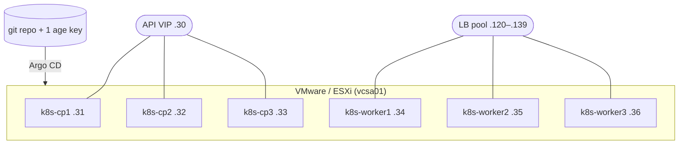

# Building a homelab Kubernetes cluster I can actually rebuild

I have built homelab clusters before, and the thing that always rots is *recoverability*. A
cluster accretes hand-applied YAML, a secret someone `kubectl create`d once and never wrote
down, a node that was special for reasons nobody remembers. Six months later "rebuild it" means
"reconstruct it from memory and hope." This time the single design goal was: **bootstrap from
nothing to a fully working cluster, from one git repo plus one key.** Everything else followed
from that.

## The shape of it

`k8s-talos1` is six VMs on a VMware/ESXi cluster — three control planes and three workers —
running **Talos Linux** with Kubernetes installed on top. Terraform makes the VMs; the cluster
then populates *itself* from this git repo with Argo CD.

| | |
|---|---|
| Control planes | `k8s-cp1/2/3` = `.31/.32/.33` · 2 vCPU · 8 GiB · dedicated (tainted), etcd + API only |
| Workers | `k8s-worker1/2/3` = `.34/.35/.36` · 6 vCPU · 24 GiB · +300 GiB Longhorn disk · all workloads |
| API VIP | `.30` (Talos-managed, layer-2) on the `172.16.23.0/24` network |
| Versions | Talos **v1.13.3**, Kubernetes **v1.36.1** |

## The stack, and why

Each choice below has its own post and, where there was a real tradeoff, an ADR. The short
version:

- **Talos Linux** — an immutable, API-driven OS with no SSH and no package manager. You
  configure it by applying a machine-config document, not by logging in. That is exactly the
  property "rebuildable from git" wants.
- **Terraform + talosctl, no Ansible** — Terraform owns the VMware layer, `talosctl` owns the
  cluster. Ansible's SSH-and-modules model has nothing to log into on Talos. ([ADR-0003](../adr/0003-terraform-talosctl-no-ansible.md))
- **SOPS + age, one key** — all secrets, both the Talos PKI and the Kubernetes app secrets, are
  encrypted *into* git with a single age key. That is what makes "one repo + one key" literally
  true. ([ADR-0005](../adr/0005-sops-age-single-key.md))
- **Argo CD, release-pinned to a tag** — the cluster tracks an immutable SemVer tag, not a
  branch. A deploy is a deliberate, named, revertible event. ([ADR-0006](../adr/0006-release-pinned-gitops.md))
- **Cilium** — one component for CNI, kube-proxy replacement, L2 LoadBalancer, and Gateway API.
  Talos ships none of these, so something had to. ([ADR-0004](../adr/0004-cilium-l2-gateway-api.md))
- **Longhorn + CloudNativePG** — replicated block storage for general PVCs, and real Postgres
  HA for databases, each owning its own replication. ([ADR-0007](../adr/0007-longhorn-cnpg-storage-model.md))
- **Authentik + cert-manager** — SSO, and real Let's Encrypt wildcard certs via DNS-01.
- **Four backup layers + Veeam** — etcd, Postgres, volumes, and k8s resources all to off-site
  S3, plus a weekly whole-VM cold image. ([ADR-0008](../adr/0008-backups-two-host-limitation-veeam.md))

## The honest caveat

There are only **two ESXi hosts**. Three control planes across two hosts means one host runs two
etcd members, so losing that host loses quorum. A third host is planned; until then the mitigation
is the backup layers and the weekly Veeam cold image, and the risk is written down rather than
hidden ([ADR-0008](../adr/0008-backups-two-host-limitation-veeam.md)). I would rather ship a
cluster with a known, documented limitation than pretend it is something it is not.

The rest of these posts walk the build in the order it happened: VMs, Talos, GitOps, networking,
storage, identity, and the part that actually matters — getting it all back.
