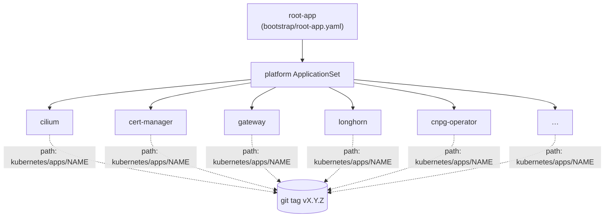

# Handing the cluster to Argo CD

There are six nodes, an etcd quorum, and an API endpoint — and the whole thing is `NotReady`
because there is no CNI. From here on I wanted to stop running `kubectl apply` by hand. The goal
was to apply *one* thing and have the cluster pull everything else from git, forever. This post
is the seam where imperative bring-up ends and GitOps takes over.

## Two things have to go in by hand

GitOps has a chicken-and-egg problem: Argo can't sync the repo until Argo exists and can decrypt
secrets, and it can't do *that* until the network is up. So the bootstrap script applies exactly
two things imperatively, and nothing more:

1. **Cilium**, so the nodes go `Ready`. (The networking details are their own post; here it is
   just "the CNI, installed first so everything else has a network.")
2. **Argo CD + its two seed secrets** — the `sops-age` key and the read-only git deploy key.

Everything after that is pulled from git.

## KSOPS: teaching Argo to read encrypted secrets

The repo is full of `*.sops.yaml` files — encrypted secrets committed straight into git
([ADR-0005](../adr/0005-sops-age-single-key.md)). For Argo to turn those into real Kubernetes
Secrets during a sync, its repo-server needs to decrypt them. That is **KSOPS**
(`viaductoss/ksops:v4.5.1`), wired into the argocd-repo-server as an initContainer plus a
`sops-age` volume and `SOPS_AGE_KEY_FILE`, with `kustomize.buildOptions:
--enable-alpha-plugins --enable-exec --enable-helm`.

The one secret that can't be encrypted in the repo is the age key itself — that would be locking
the key inside the box it opens. So the `sops-age` secret is the one piece of bootstrap material
applied out of band. Once it is in, the repo-server comes up `1/1` and every other secret in the
cluster decrypts itself from git.

## App-of-apps, pinned to a tag

The structure is a classic app-of-apps:

`root-app` points Argo at `kubernetes/apps/platform-appset.yaml`, an **ApplicationSet** that
generates one Application per component from a list — each with a name, a namespace, and a
**sync-wave** so they come up in dependency order (`-10` Cilium first … `15` Authentik last). The
component dirs are plain kustomize (`helm` charts rendered via the KSOPS-enabled kustomize).

The single most important line in that file is `targetRevision`. **The cluster tracks an
immutable SemVer tag, not a branch** ([ADR-0006](../adr/0006-release-pinned-gitops.md)). That
revision is defined once in the ApplicationSet, mirrored in `root-app.yaml`, and bumped only by
`scripts/release.sh`, which moves both pins plus `VERSION` in lockstep and tags the release. So
"what is running" is a name (`v0.1.2`), a deploy is a deliberate event, and rollback is repointing
to the previous tag. Committing to the `build` branch never touches the cluster.

> **A real-world wrinkle:** during initial bring-up the pins temporarily tracked `build` so I
> could iterate without cutting a tag for every fix, then I pinned back to a tag once it was
> green. Convenient during construction, exactly the drift to avoid once live — and called out
> as such in the ADR.

One more thing earns its keep here: `ServerSideDiff=true` on the generated Applications. Without
it, controller- and apiserver-owned fields (Gateway API route defaults, CNPG mutating-webhook
fields) show up as permanent false `OutOfSync`. Server-side diff scopes the comparison to the
fields Argo actually manages. With that in place the platform settles to **11/11 Synced/Healthy**,
and from then on the cluster maintains itself from git.
