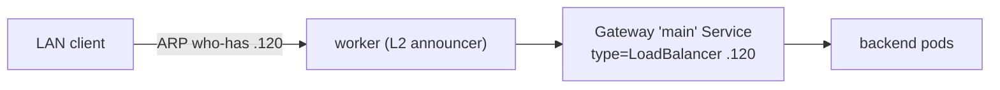

# Cilium: CNI, kube-proxy, L2 LoadBalancer, Gateway API

Talos ships no CNI and no kube-proxy on purpose. That sounds like a gap; it is actually an
invitation to pick one thing that does the whole job well instead of bolting together three. I
picked **Cilium 1.19.4**, and it provides four things that are usually four separate projects:
the CNI, a kube-proxy replacement, bare-metal `LoadBalancer` Services, and Gateway API ingress.
The reasoning and the tradeoffs are in [ADR-0004](../adr/0004-cilium-l2-gateway-api.md); this
post is how it actually fits together.

## CNI and kube-proxy replacement

`kubernetes/apps/cilium/values.yaml` turns on the eBPF kube-proxy replacement:

```yaml
kubeProxyReplacement: true
k8sServiceHost: "172.16.23.30"   # the control-plane VIP
k8sServicePort: 6443
```

There is a subtlety in `k8sServiceHost`: with no kube-proxy, Cilium itself needs a concrete
address to reach the API server — it can't bootstrap through the `kubernetes` Service it is about
to start managing. So it points at the **Talos-managed VIP `.30`** directly. Talos also needs a
few specific securityContext capabilities and `cgroup.autoMount: false` because the OS is
immutable — the kind of platform-specific tuning that has to match or the agent won't start.

Installing Cilium is what finally flips the six nodes from `NotReady` to `Ready`.

## LoadBalancer with no cloud and no MetalLB

On a home VLAN there is no cloud load balancer, and I did not want to run MetalLB as a separate
project when Cilium does this natively. Two CRDs:

- a **`CiliumLoadBalancerIPPool`** (`lb-pool.yaml`) carving out `172.16.23.120–.139`;
- a **`CiliumL2AnnouncementPolicy`** (`l2policy.yaml`) so a node answers ARP for those IPs.



This is **layer-2** load balancing: one node answers for a given IP at a time within the broadcast
domain. Perfectly fine for a single-VLAN home lab; it is not a routed/ECMP design and I am not
pretending it is.

> **Version coupling bit me here, twice.** Cilium 1.19 is *version-locked* to **Gateway API
> v1.4.1** — install "latest" (v1.5.1) and the operator disables Gateway API entirely. And the
> operator registers `v1alpha2.TLSRoute` in its scheme unconditionally, so the **experimental
> `tlsroutes` CRD must be present at operator startup** or it error-loops on every gateway
> reconcile. Both are pinned and explained in `VERIFIED-VERSIONS.md`. This is the whole reason
> the project has a "verify upstream before you write config" rule.

## Gateway API instead of Ingress

For ingress I used **Gateway API**, the successor to Ingress, with Cilium providing the `cilium`
GatewayClass (`gatewayAPI.enabled: true`). One more offline-render gotcha: the chart's
`gatewayClass.create: auto` only emits the GatewayClass if the *live* cluster already has the API
— but kustomize/Argo render **offline**, so `auto` evaluates false and silently drops it. The fix
is `gatewayClass.create: "true"`.

The model is one shared **`Gateway main`** (in `kubernetes/apps/gateway/`) that lands on `.120`
and terminates the wildcard TLS cert, and each app attaches with an `HTTPRoute` rather than
standing up its own ingress. There is also an HTTP→HTTPS redirect route. So the whole cluster has
a single front door at a single IP, and adding an app means adding a route — which is exactly how
Authentik plugs in two posts from now.

With networking up, the nodes are `Ready`, services are reachable, and there is a Gateway waiting
for routes. Next: somewhere to put the data.
