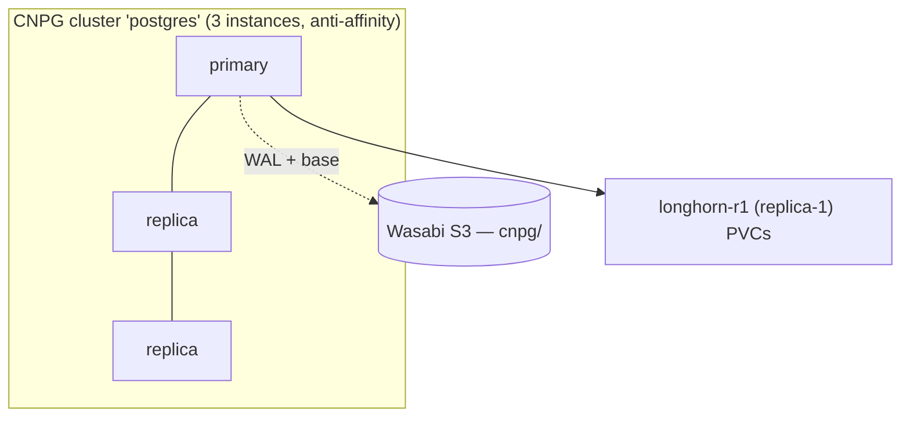

# Longhorn and CloudNativePG

The most common storage mistake I see in homelabs is treating "I have replicated block storage"
as "my database is highly available." They are different problems, and solving them with one tool
makes both worse. So this cluster runs two storage systems, each owning exactly one job:
**Longhorn** for general replicated volumes, **CloudNativePG** for Postgres. The reasoning is in
[ADR-0007](../adr/0007-longhorn-cnpg-storage-model.md); here is how each is set up.

## Longhorn: replicated block storage, workers-only

`kubernetes/apps/longhorn/` deploys **Longhorn 1.12.0** on the three workers' 300 GiB data disks.
Workers-only falls out for free: the control planes carry the `control-plane:NoSchedule` taint
([ADR-0002](../adr/0002-dedicated-control-planes.md)) and Longhorn adds no toleration, so its
components simply never land there — no nodeSelector gymnastics needed. (It does need the
`iscsi-tools` + `util-linux-tools` extensions, which is why they were baked into the node image
back in post 2.)

Two StorageClasses:

- the **default**, `persistence.defaultClassReplicaCount: 3` — three block copies, for ordinary
  PVCs that want the storage layer to handle durability;
- **`longhorn-r1`** (`storageclass-replica1.yaml`) — a single copy, for workloads that replicate
  their *own* data and don't want Longhorn doing it again underneath them. Postgres is the
  customer for this one.

> **A key that moved:** Longhorn 1.12 removed the legacy `backup-target` *setting*. The backup
> destination now lives under **`defaultBackupStore.backupTarget`** /
> `defaultBackupStore.backupTargetCredentialSecret` (S3 URL with a *trailing slash*, seeded once
> at first boot). I got this wrong initially — the backup target came up empty — and the fix plus
> a one-time live `kubectl patch backuptarget.longhorn.io default` is recorded in
> `VERIFIED-VERSIONS.md`. The daily volume backup itself is a RecurringJob (04:00, retain 7).

## CloudNativePG: let Postgres own its own HA

`kubernetes/apps/cnpg-operator/` installs the **CloudNativePG 1.29.1** operator; `cnpg-cluster/`
defines the actual database — a **3-instance HA cluster** (`postgres`) with worker anti-affinity
so the instances spread across the three workers.

The decision that ties the storage model together: the CNPG PVCs use the **`longhorn-r1`
replica-1** StorageClass. **Postgres owns HA** via streaming replication and failover, so Longhorn
must *not* replicate the blocks underneath it. Put a 3-instance Postgres on the replica-3 default
and you get nine physical copies of the data and two systems fighting over the fsync path. One
copy per instance, three instances, Postgres in charge — that is the right shape.

Backups are the modern CNPG path: the **Barman Cloud Plugin v0.12.0**, not the deprecated
in-Cluster `barmanObjectStore` field (CNPG 1.26+ pushes everything through the plugin). It is its
own appset component (`barman-cloud-plugin`, sync-wave 3), needs cert-manager for its webhook
certs, and the cluster wires it via `spec.plugins[]` referencing an `ObjectStore` (`wasabi-store`)
that points at Wasabi. A `ScheduledBackup` (02:00) takes base backups while WAL is archived
continuously — which is what makes point-in-time recovery possible.

The database also provisions Authentik's role and database declaratively (CNPG `managed.roles`
plus a `Database` CRD), so the next post's identity stack has a home before it is even deployed.
Two storage systems, two clean responsibilities, and every byte of it backed up off-site — which
is the subject of the final post.
