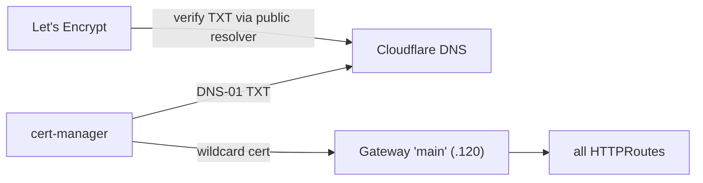

# Authentik and real certificates

Two things separate a cluster that is "up" from one that is pleasant to *use*: single sign-on, so
apps share one login, and certificates browsers actually trust, so nobody clicks through a
warning. This post covers both — **cert-manager** issuing a real Let's Encrypt wildcard, and
**Authentik** as the identity provider, sitting on the storage layer from the last post.

## Real certificates via DNS-01

`kubernetes/apps/cert-manager/` runs **cert-manager v1.20.2** with a single ClusterIssuer:
Let's Encrypt, **ACME DNS-01 via Cloudflare**. DNS-01 (rather than HTTP-01) is the right choice
here for two reasons: it issues a **wildcard** `*.k8s-talos1.ap169homeoffice.net` in one go, and
it never needs an inbound path from the public internet to the cluster — cert-manager just proves
control of the domain by writing a TXT record.

A couple of details that the current chart gets particular about:

- CRDs are installed with **`crds.enabled: true`** (the old `installCRDs` flag is deprecated, and
  the default is *off* — easy to miss).
- The Cloudflare API token needs **Zone:DNS:Edit + Zone:Zone:Read**, and lives in a SOPS-encrypted
  secret like everything else ([ADR-0005](../adr/0005-sops-age-single-key.md)).
- **Split-horizon DNS** is the sharp edge. The internal Technitium resolver serves this zone, so
  cert-manager's DNS-01 *self-check* would query the internal view and never see the public TXT
  record. The fix is `--dns01-recursive-nameservers-only` pointing at public resolvers
  (`1.1.1.1`, `8.8.8.8`) so the self-check validates against what Let's Encrypt will actually see.

The wildcard `Certificate` itself lives with the gateway (post 5): the shared `Gateway main`
terminates TLS with it, so every app behind the gateway gets a trusted cert for free. The Cert
comes up **Ready** via `letsencrypt-prod` — genuinely trusted, not self-signed.

## Authentik on top of the platform

`kubernetes/apps/authentik/` deploys **Authentik 2026.5.2** as the SSO/OIDC provider — and it is
a nice demonstration that the platform underneath it actually works, because Authentik consumes
almost every layer:

- **Database:** the external CNPG `postgres` cluster from post 6 (the chart's bundled PostgreSQL
  subchart is disabled; the role and database were provisioned declaratively by CNPG).
- **Redis:** the chart bundles Postgres but **not** Redis, so I self-host a small one
  (`redis.yaml`) — a gap worth knowing before you deploy.
- **Ingress:** an `HTTPRoute` attached to the shared `Gateway main`, so it is reachable over the
  trusted wildcard cert with no per-app ingress.
- **Storage:** an RWX Longhorn PVC for media.
- **Secrets:** `AUTHENTIK_SECRET_KEY` and the Postgres password go in a KSOPS secret surfaced via
  `global.envFrom` (which Authentik appends to *both* the server and worker — verified, because
  getting it on only one is a confusing half-broken state).

None of those are hand-wired; they are the layers from the previous posts doing their jobs. That
is the payoff of building bottom-up: by the time you get to the application, "give it a database,
a cache, storage, a trusted URL, and encrypted secrets" is just five references to things that
already exist.

What is left is the question I cared about most from the start: when this all breaks, how do I get
it back?
