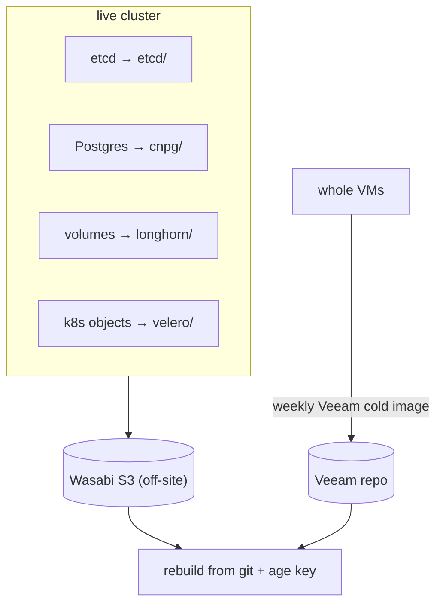

# The part that matters: getting it all back

Everything up to here was about *building* the cluster. This post is about the assumption that it
will, at some point, break — and that the only thing that counts is whether I can get the data and
the cluster back. The whole project started from "rebuildable from one git repo plus one key," so
disaster recovery is not an afterthought bolted on at the end; it is the thing the rest was in
service of. The decisions are in [ADR-0008](../adr/0008-backups-two-host-limitation-veeam.md);
this is the working model.

## Why four layers and not one

A single backup tool cannot cover this cluster, because "the cluster" is several different
recovery problems. etcd is the cluster's brain; Postgres is application data with its own
point-in-time semantics; Longhorn volumes are raw block data; and the Kubernetes API objects
(Deployments, Services, the lot) are a fourth thing again. Each has a different RPO and a different
restore procedure. So there are **four independent in-cluster layers, all landing off-site in
Wasabi S3** (`homeoffice-k8s-backups`):

| Layer | Protects | Mechanism | Schedule | Prefix |
|---|---|---|---|---|
| etcd snapshot | cluster state | Talos-native `etcd snapshot` CronJob | 01:00 | `etcd/` |
| CNPG / Barman | Postgres (base + WAL, PITR) | Barman Cloud Plugin | 02:00 + WAL | `cnpg/` |
| Velero | k8s API resources | Velero + AWS plugin | 03:00, 30d | `velero/` |
| Longhorn | block volume data | RecurringJob | 04:00, retain 7 | `longhorn/` |

All four were **verified actually landing in Wasabi** (P8.1) — not "configured," confirmed, by
triggering an on-demand backup of each and reading the object back. That verification found two
real defects, both worth repeating because they are exactly the kind that hide until you test:
the Longhorn backup target was empty (the `defaultSettings` → `defaultBackupStore` key move from
post 6), and the etcd CronJob was missing `--nodes`, so `talosctl etcd snapshot` errored on its
first real run. A backup you have never restored from is a hope, not a backup.

## The fifth layer, and the reason for it

There is a structural problem these four layers cannot solve: **only two ESXi hosts**. Three
control planes across two hosts means one host runs two etcd members, and losing that host loses
quorum — the cluster's brain. The in-cluster backups all assume there *is* a cluster to run them
in. So there is a fifth, quorum-independent layer: a **weekly Veeam cold whole-VM image**.

The Veeam image is **crash-consistent on a gracefully quiesced cluster**:
`scripts/cluster-shutdown.sh` cordons all nodes, hibernates CNPG, drains the workers, waits for
every Longhorn volume to detach, then `talosctl shutdown`s the workers and control planes in
order; `scripts/cluster-startup.sh` powers them back on via `govc` in the right sequence and
un-quiesces everything. Both are `--dry-run`-capable and shellcheck-clean. A real run is gated —
it belongs in an actual Veeam maintenance window.

## The runbook, and the one key

`docs/DR-RUNBOOK.md` documents a restore for **every** layer, with exact commands: node replace,
etcd recover-from-snapshot (`talosctl bootstrap --recover-from`), Velero restore, Longhorn
restore, CNPG Barman recovery, the Veeam whole-VM fallback — and the headline case, a **full
rebuild from git + age + Wasabi**: `terraform apply` → `bootstrap.sh` → Argo syncs the pinned tag
→ restore the data. That last path is the whole thesis of the project working in reverse.

The runbook's §0 lists the four recovery assets, and one of them is load-bearing above all others:
the **age key** ([ADR-0005](../adr/0005-sops-age-single-key.md)). Lose it and every backup in
Wasabi is unreadable ciphertext and the git repo is a pile of locked secrets. So the single most
important thing to protect in this entire architecture is not a server or a snapshot — it is one
small key file, backed up out of band, away from the cluster it unlocks.

## Honest status

The restores are **documented and the artifacts are confirmed present in Wasabi**, but a live
end-to-end DR drill — shut down, restore from Veeam, rebuild, verify — has not been run yet. That
is the top of the follow-up list, alongside an internal DNS record for the gateway and a metrics
stack. Documented-and-verified-on-disk is a real bar; tested-by-actually-doing-it is a higher one,
and I would rather say exactly where the line is than imply I have crossed it.

That is the cluster: built from a repo, secured by one key, and — by design — gettable back.
